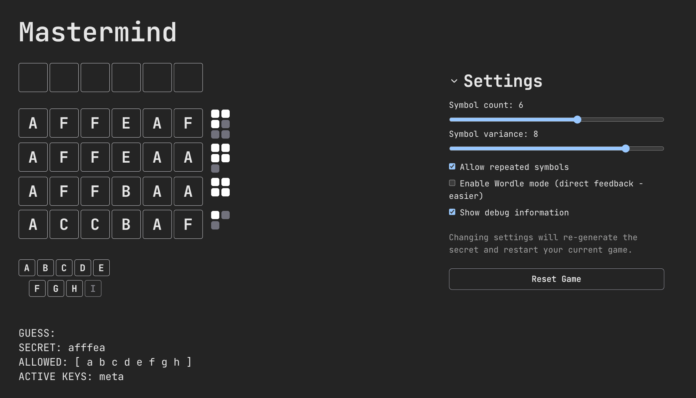
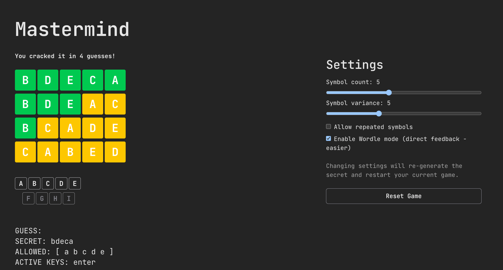
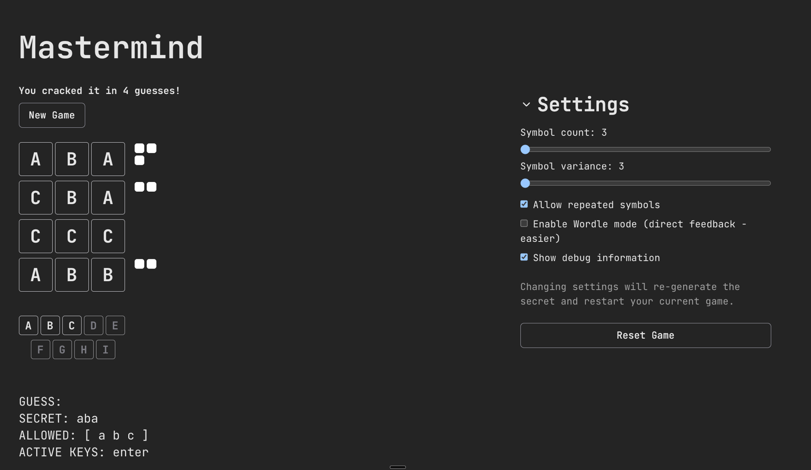

# Mastermind

A keyboard-driven code-breaking puzzle game built with React and TypeScript.

**Live demo → [mastermind-theta-ebon.vercel.app](https://mastermind-theta-ebon.vercel.app/)**

---

## About

This project is a browser implementation of the classic Mastermind game — but instead of coloured pegs, it uses letters. A secret sequence is generated and the player tries to crack it by typing guesses on the keyboard.

After each submitted guess the player receives feedback:
- **White squares** — correct symbol in the correct position
- **Grey squares** — correct symbol in the wrong position

The game also supports an optional **Wordle mode**, which colours each cell directly (green / yellow) instead of showing aggregate result pins.

The primary goal of this project was to explore **keyboard-first interaction** — the entire game is played without touching the mouse. A secondary goal was to try **Bun** as a runtime and test runner for the first time.

---

## Screenshots







---

## Tech Stack

- **React 19** + **TypeScript** (strict mode)
- **Zustand 5** for state management
- **Tailwind CSS 4** for styling
- **Vite 7** with React Compiler
- **Bun** for running tests

---

## Running locally

```bash
bun install
bun run dev
```

Tests:

```bash
bun test
```
